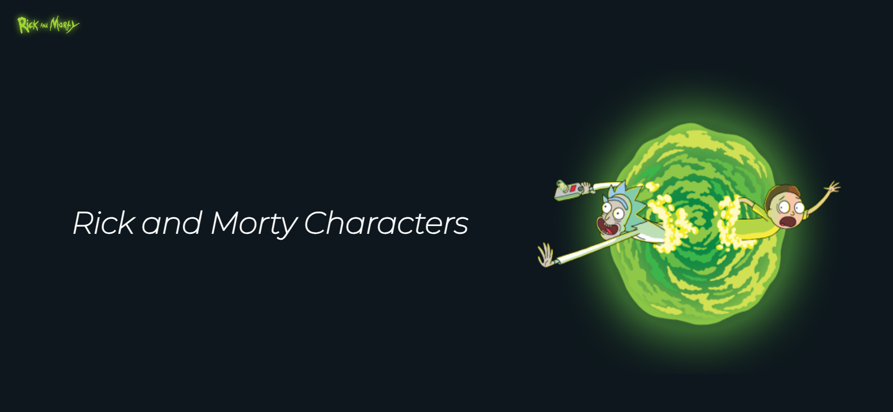

<p align="center">



   <h3 align="center">Rick and Morty Characters</h3>
   <p align="center"> This application allows users to explore characters from the show and view detailed information about each character.</p>
</p>

## Deployed Link : https://ricksmorty.vercel.app/

## Technologies Used 💻


### API

[Rick and Morty API](https://rickandmortyapi.com/api/character/)

# Rick and Morty App

Welcome to the Rick and Morty app! This application allows users to explore characters from the show and view detailed information about each character.

## Getting Started

Follow the steps below to run the application locally:

### Prerequisites

Make sure you have Node.js installed on your machine.

### Installation

1. Clone this repository to your local machine.

```bash
git clone https://github.com/ItsRoy69/Rick-and-Morty
```

2. Navigate to the project directory.

```bash
cd Rick-and-Morty
```

3. Navigate to frontend directory of the a web app.

```bash
cd client
```

3. Install dependencies.

```bash
npm install
```
3. Navigate to backend directory of the a web app.

```bash
cd server
```

3. Install dependencies.

```bash
npm install
```
### Running the App

1. Start the backend server.

```bash
npm start
```

This will launch the Node.js backend server that fetches data from the Rick and Morty API.

2. Start the frontend application.

```bash
npm run dev
```

Visit https://ricksmorty.vercel.app in your browser to explore the Rick and Morty app.

Visit https://rick-and-morty-al6l.onrender.com/api/characters in your browser to explore the server side of the Rick and Morty app.

## Features

### 1. Character List

- A component displays a list of characters fetched from the Rick and Morty API.
- Each character card shows the name, image, and species.

### 2. Character Detail

- Clicking on a character in the list navigates to a detail page.
- The detail page fetches additional information about the character from the API.
- Displays the character's name, image, species, status, origin, and location.

### 3. Navigation

- Users can easily navigate between the character list and detail pages.
